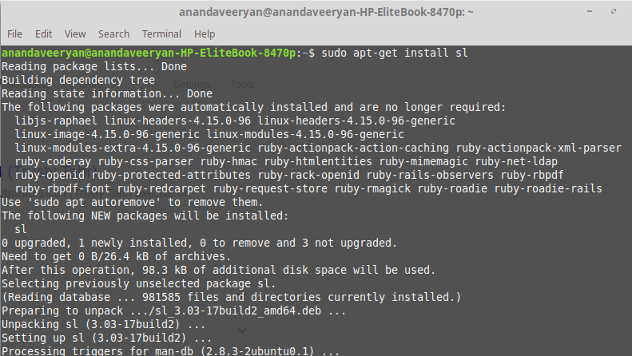

# linuxlab_practice
# Simple Scripts
## Script 1 - sl command
### Installing sl 

### Output of sl

## Script 2 - rev, factor, yes commands
### rev command output

### factor commmand output

### yes command output

# Hot Question
## Write a bash shell script to monitor the health of your system. Let the details be stored and archived in any folder of your choice.
The script for this question is available in healthmonitor.sh file.
To make it run for every 2 hours we have to use crontab.
  
  
  
This will make it to run for every 2 hours. After every 2 hours the output files will be generated as shown below.  
  
  
  
The output file will contains the system stats.  
  

